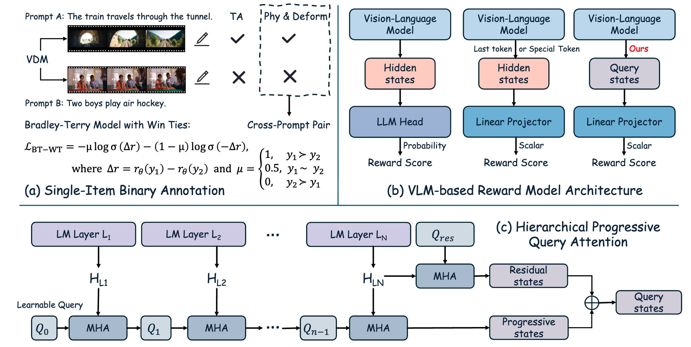

# SoliReward: Mitigating Susceptibility to Reward Hacking and Annotation Noise in Video Generation Reward Models

[](https://arxiv.org/abs/2512.22170)

## Abstract

Post-training alignment of video generation models with human preferences is a critical goal. Developing effective Reward Models (RMs) for this process faces significant methodological hurdles. Current data collection paradigms, reliant on in-prompt pairwise annotations, suffer from labeling noise. Concurrently, the architectural design of VLM-based RMs, particularly their output mechanisms, remains underexplored. Furthermore, RM is susceptible to reward hacking in post-training. To mitigate these limitations, we propose SoliReward, a systematic framework for video RM training. Our framework first sources high-quality, cost-efficient data via single-item binary annotations, then constructs preference pairs using a cross-prompt pairing strategy. Architecturally, we employ a Hierarchical Progressive Query Attention mechanism to enhance feature aggregation. Finally, we introduce a modified BT loss that explicitly accommodates win-tie scenarios. This approach regularizes the RM's score distribution for positive samples, providing more nuanced preference signals to alleviate over-focus on a small number of top-scoring samples. Our approach is validated on benchmarks evaluating physical plausibility, subject deformity, and semantic alignment, demonstrating improvements in direct RM evaluation metrics and in the efficacy of post-training on video generation models. Code and benchmark will be publicly available.

## Pipeline



## TODO

- [x] Release training code
- [x] Release inference code
- [ ] Release model weights

## Quick Start

### 1. Environment Setup

```bash
cd SoliReward
bash scripts/setup_env.sh
conda activate solireward
```

### 2. Training

Modify the configuration in `scripts/solireward_train.sh` and run:

```bash
bash scripts/solireward_train.sh
```

### 3. Inference

Modify the configuration in `scripts/solireward_infer.sh` and run:

```bash
bash scripts/solireward_infer.sh
```

## Supported Models

| Model Type  | Parameter Name | Description               |
| ----------- | -------------- | ------------------------- |
| InternVL3   | `InternVL3`    | InternVL3 series models   |
| InternVL3.5 | `InternVL3-5`  | InternVL3.5 series models |
| Qwen2.5-VL  | `Qwen2.5-VL`   | Qwen2.5-VL series models  |
| Qwen2-VL    | `Qwen2-VL`     | Qwen2-VL series models    |

## Data Format

### Training Data

JSON file containing win/lose pair data:

```json
[
  {
    "win": [...],
    "lose": [...],
    "meta": {"win": {"quality": 1.0}, "lose": {"quality": 0.0}}
  }
]
```

### Inference Data

```json
[
  {"video_path": "/path/to/video.mp4"},
  {"video_path": "/path/to/video2.mp4", "prompt": "description text"}
]
```

## Loss Functions

- **BT Loss**: Bradley-Terry ranking loss
- **BTT Loss**: Bradley-Terry-Tie loss for handling tie samples
- **BCE Loss**: Binary Cross Entropy for absolute quality prediction

## Main Arguments

| Argument                           | Description                                                                                                                                                                     | Default Value                        |
| ---------------------------------- | ------------------------------------------------------------------------------------------------------------------------------------------------------------------------------- | ------------------------------------ |
| `--model_type`                     | Model type                                                                                                                                                                      | `InternVL3`                          |
| `--bt_loss_coeff`                  | BT loss coefficient                                                                                                                                                             | `1.0`                                |
| `--bce_loss_coeff`                 | BCE loss coefficient                                                                                                                                                            | `0.0`                                |
| `--reward_margin`                  | Reward margin                                                                                                                                                                   | `3.0`                                |
| `--reduce_sequence`                | Reward model head architecture. Defines the method for aggregating video frame sequences into a final reward score                                                              | `progressive_hierarchical_attention` |
| `--hierarchical_query_attn_layers` | Space-separated layer indices to add hierarchical query attention. Only used when `reduce_sequence='progressive_hierarchical_attention'`. Example: `'6 12 18 24'` for 1B models | `'6 12 18 24'`                       |
| `--enable_btt_loss`                | Enable Bradley-Terry-Tie loss (set to `1` to enable). **Required when training data contains tie samples** (samples where win and lose have similar quality)                    | `0`                                  |

## Citation

If you find this project helpful for your research, please cite our paper:

```bibtex
@article{lian2025solireward,
  title={SoliReward: Mitigating Susceptibility to Reward Hacking and Annotation Noise in Video Generation Reward Models},
  author={Lian, Jiesong and Zhong, Ruizhe and Zhou, Zixiang and Mi, Xiaoyue and Hao, Yixue and Zhou, Yuan and Lu, Qinglin and Hu, Long and Yan, Junchi},
  journal={arXiv preprint arXiv:2512.22170},
  year={2025}
}
```

## Acknowledgments

This project is built upon the following excellent open-source projects:

- [Transformers](https://github.com/huggingface/transformers)
- [TRL](https://github.com/huggingface/trl)

We thank the Hugging Face team for their valuable contributions to the open-source community.

## License

MIT License
